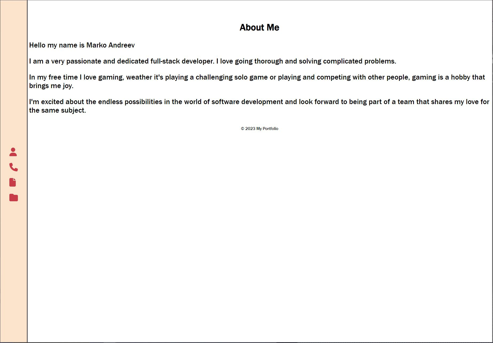

# Portfolio

## Screenshot

## Description

This is my personal IMPROVED portfolio using React!

## Installation 

To install this application, git clone this repository to your local computer. The user must also install Node.js in order to use this application.

## Usage

This application is deployed to heroku, you can follow the link below to navigate to the site.

## Contribution

This application is homework for Northwestern Coding Bootcamp and is complete, there is no need for any contributions.

## Testing

You can test this application  by running the command line prompt "npm start" after installing the required node packages from VS code.
